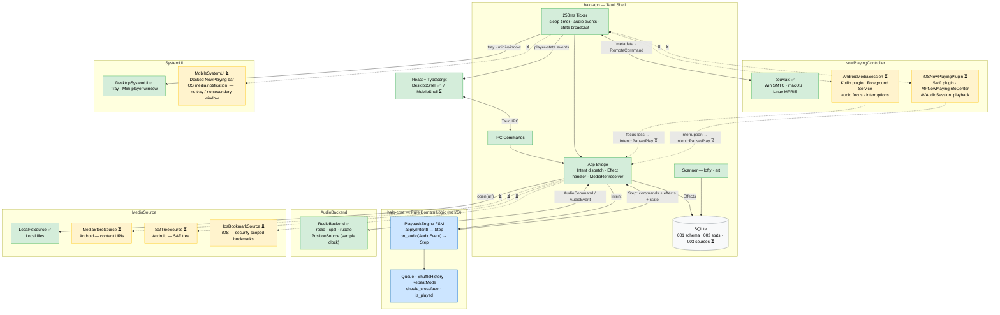
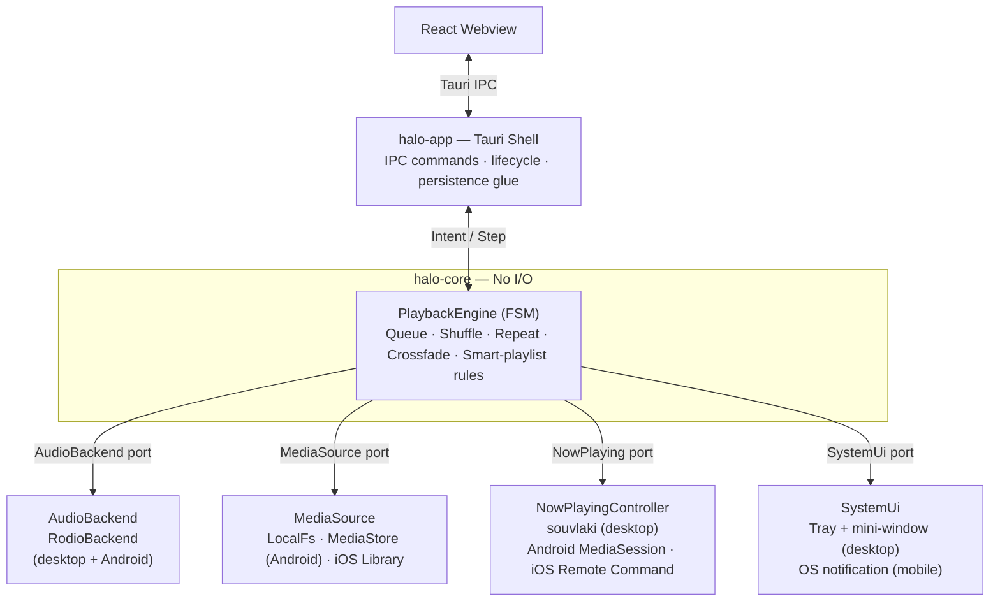
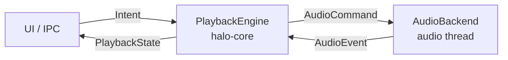
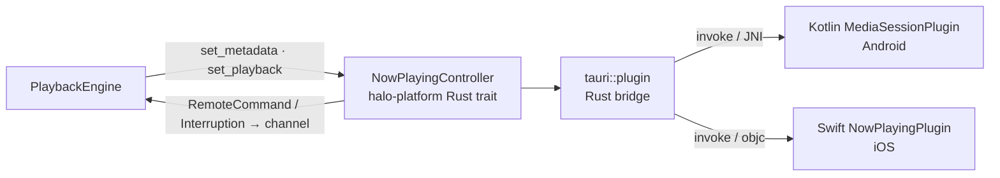
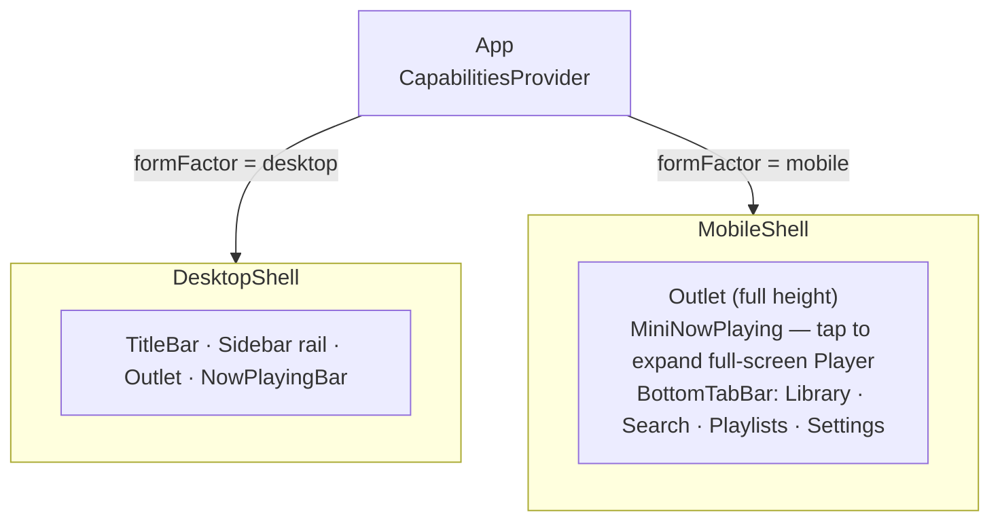

# Halo — Cross-Platform Architecture Redesign

Target: a single codebase that runs well on **Windows, macOS, Linux, Android, and iOS**,
with a clean, testable core and platform specifics isolated behind well-defined boundaries.

This document describes the *target* architecture and an *incremental* path to get there
without a big-bang rewrite. It is a design reference, not a committed plan — promote phases
into [ACTIVE_WORK.md](../ACTIVE_WORK.md) when starting them.

---

## 0. Architecture Diagram

> Green = complete · Yellow = pending (Phase D/E) · Blue = pure core · solid = current · dashed = planned



---

## 1. Why the current design blocks mobile

The app works well on Windows, but several design choices are load-bearing on assumptions
that only hold on the desktop:

| Area | Current coupling | Problem off Windows / on mobile |
|---|---|---|
| **Audio** | `audio/mod.rs` worker owns `rodio` types (`Sink`, `OutputStreamHandle`) directly; decodes from a `PathBuf` via `File::open`. | rodio/cpal *can* target all five platforms, but the engine is welded to rodio's API and to filesystem paths. Mobile media comes as content URIs / asset FDs / security-scoped bookmarks, **not** `PathBuf`. |
| **Position** | Computed from wall-clock `Instant::elapsed()` + `base_offset_ms`. | Drifts vs. real audio clock; ignores underruns, device/route changes. Mobile route changes (BT, call interrupt) make this worse. |
| **Advance/crossfade** | A 250 ms polling thread in `lib.rs` reaches into the DB, compares position to duration, and flips a `finished` flag. | Busy poll; imprecise crossfade timing; logic that should be unit-testable is entangled with DB + Tauri + threads. |
| **Library scan** | `scanner/walker.rs` recursively walks user folders with `walkdir`. | iOS sandbox forbids arbitrary FS walking; Android 10+ scoped storage forbids walking `/sdcard`. Must use SAF/MediaStore (Android) or document picker / `MPMediaQuery` (iOS). |
| **Track identity** | `tracks.file_path` (string) is the natural key. | Mobile has no stable file paths; identity must be a `source_uri` + source type + (optionally) a persisted permission bookmark. |
| **Media controls** | `souvlaki` (Windows SMTC / macOS / MPRIS) on a dedicated thread; HWND + AUMID shortcut hardcoded in `lib.rs`. | souvlaki does not cover mobile. Android needs `MediaSessionCompat` + foreground service; iOS needs `MPNowPlayingInfoCenter` + `MPRemoteCommandCenter` (native plugin code). |
| **Windowing** | Tray icon, hidden-not-closed main window, separate mini-player window, `skip_taskbar` toggling. | Mobile has no tray, no multiple OS windows, no taskbar. These must become no-ops or OS equivalents. |
| **Frontend** | Custom title bar with window controls (`decorations:false`), icon sidebar rail, hover-only mini-player controls. | Mobile has no window chrome, no hover, needs touch targets, bottom nav, gestures, safe-area insets. |
| **Lifecycle** | None. Assumes a long-lived desktop process. | Mobile needs audio focus handling, interruption (calls), headphone-unplug pause, background execution (foreground service / background-audio mode). |

The DB layer (`rusqlite` bundled) and metadata (`lofty`) are already portable and stay.

---

## 2. Target architecture: ports & adapters (hexagonal)

The organizing principle: a **platform-agnostic core that performs no I/O**, surrounded by
**adapters** that implement platform behavior behind traits ("ports"). The core is pure
logic and is unit-testable without audio hardware, a database, or Tauri.



### Workspace layout

Move from one `src-tauri` crate to a Cargo **workspace** of focused crates. This enforces
the boundaries at compile time (core literally cannot depend on Tauri or rodio).

```
halo/
├── Cargo.toml                  # [workspace]
├── crates/
│   ├── halo-core/              # domain logic, ports (traits), NO platform deps
│   ├── halo-audio/             # AudioBackend impls (rodio; future native)
│   ├── halo-db/                # rusqlite repositories + migrations
│   ├── halo-media/             # lofty metadata, art extraction/cache
│   ├── halo-sources/           # MediaSource impls (local FS, MediaStore, iOS)
│   └── halo-platform/          # NowPlaying + SystemUi impls per OS
├── src-tauri/                  # halo-app: thin Tauri shell, command registration
│   └── gen/                    # tauri android/ios generated projects
└── src/                        # React frontend (adaptive)
```

`halo-core` depends only on `serde` + std (+ maybe `thiserror`). Everything platform-specific
is injected at startup by `halo-app` via `Box<dyn Trait>` / generics.

---

## 3. The audio engine redesign (this is the crux)

The selected `decode_resampled` / `load_into_worker` / `start_crossfade` functions are the
right place to start because they encode three coupling problems at once: rodio types,
filesystem paths, and wall-clock position. The redesign:

### 3.1 Decode from a reader, not a path

The single most important change for mobile. Today:

```rust
fn decode_resampled(path: &PathBuf, output_rate: u32) -> ... {
    let file = File::open(path)?;
    let decoder = Decoder::new(BufReader::new(file))?;
    ...
}
```

Both `lofty` and `rodio`/`symphonia` accept any `Read + Seek`. Generalize the input to a
**`MediaInput`** the `MediaSource` port produces:

```rust
// halo-core port
pub trait MediaSource: Send + Sync {
    /// Open a seekable byte stream for a track, regardless of where it lives.
    fn open(&self, handle: &MediaRef) -> Result<Box<dyn MediaInput>, SourceError>;
    fn enumerate(&self) -> Result<Vec<DiscoveredTrack>, SourceError>;
}
pub trait MediaInput: std::io::Read + std::io::Seek + Send {}
```

- `LocalFsSource` → opens a `File` (desktop + Android local files).
- `MediaStoreSource` (Android) → opens a `ParcelFileDescriptor` via content resolver.
- iOS → opens from a security-scoped bookmark or `AVAsset` export.

`decode_resampled` then takes `Box<dyn MediaInput>` instead of `&PathBuf`. Nothing else in
the decode/resample path changes — `ResampledSource` (rubato) stays as-is.

### 3.2 Define an `AudioBackend` port

```rust
pub trait AudioBackend: Send {
    fn load(&mut self, input: Box<dyn MediaInput>, replace: LoadMode) -> Result<TrackInfo, AudioError>;
    fn play(&mut self);
    fn pause(&mut self);
    fn stop(&mut self);
    fn seek(&mut self, pos: Duration) -> Result<(), AudioError>;
    fn set_volume(&mut self, v: f32);
    fn crossfade_to(&mut self, input: Box<dyn MediaInput>, fade: Duration) -> Result<TrackInfo, AudioError>;
    /// Events: Position(Duration), TrackFinished, NearEnd(remaining), DeviceChanged, Error.
    fn events(&self) -> Receiver<AudioEvent>;
}
```

- `RodioBackend` wraps the current worker (Sink/OutputStream/crossfade) behind this trait —
  almost a straight lift of the existing code.
- On mobile the same `RodioBackend` should work (cpal supports AAudio/Oboe on Android and
  CoreAudio on iOS), but is isolated so a native `AVAudioEngine`/`AAudio` backend can be
  swapped in later without touching core.

### 3.3 Real position + event-driven advance (kill the 250 ms poll)

- **Position** comes from the backend's actual sample clock, not `Instant`. Wrap the decoded
  source in a sample-counting adapter (frames played ÷ rate = position), or read symphonia's
  timestamp. Emit `AudioEvent::Position` ~4×/sec from the audio thread.
- **Advance**: backend emits `TrackFinished` → core advances the queue and asks the source
  for the next `MediaInput`. No polled `finished_flag`.
- **Crossfade trigger**: backend emits `NearEnd(remaining)` when `remaining < crossfade_ms`;
  core decides whether to start the crossfade. No DB read in a poll loop.

The 250 ms ticker in `lib.rs` shrinks to (at most) the sleep-timer countdown and a state
broadcast throttle; ideally state is pushed on change instead of polled.

### 3.4 Core playback engine is a pure state machine

`halo-core::PlaybackEngine` owns: queue (as resolved `MediaRef`s, not DB rows), current
index, shuffle history, repeat mode, crossfade policy. It consumes `Intent` (Play, Pause,
Next, Prev, Seek, SetVolume, Enqueue…) and `AudioEvent`, and produces `AudioCommand` +
`PlaybackState` snapshots. It touches neither rusqlite nor Tauri.

This makes the gnarly bits in `commands/player.rs` (`next_index`, `advance_if_finished`,
`try_start_crossfade`, shuffle-history) unit-testable in isolation — today they can't be
tested without a running app, DB, and audio device.

Persistence (current index, volume, play/skip stats) moves to `halo-app`, which subscribes
to engine state and writes through `halo-db`. The engine emits "track played/skipped" facts;
the app records them.

---

## 4. Platform integration ports

### 4.1 `NowPlayingController`
```rust
pub trait NowPlayingController: Send {
    fn set_metadata(&self, m: &NowPlayingMeta);   // title/artist/album/art/duration
    fn set_playback(&self, p: PlaybackState, pos: Duration);
    fn commands(&self) -> Receiver<RemoteCommand>; // Play/Pause/Next/Prev/Seek
}
```
- Desktop adapter = current `souvlaki` thread (Windows SMTC / macOS / MPRIS).
- Android adapter = `MediaSessionCompat` + foreground service notification (Kotlin Tauri plugin).
- iOS adapter = `MPNowPlayingInfoCenter` + `MPRemoteCommandCenter` (Swift Tauri plugin).

`handle_hotkey` in `lib.rs` already routes remote commands to player actions — keep that
router; just feed it from whichever adapter is active.

### 4.2 `SystemUi` (degrades gracefully)
```rust
pub trait SystemUi {
    fn tray(&self) -> Option<&dyn Tray> { None }
    fn secondary_window(&self, kind: WindowKind) -> Result<(), UiError> { Err(Unsupported) }
    fn notify(&self, n: &Notification);
}
```
- Desktop: tray + mini-player window + notifications.
- Mobile: tray/secondary-window are `Unsupported`; the "mini player" concept maps to the OS
  media notification / lock-screen controls (already covered by `NowPlayingController`).

The Windows AUMID-shortcut code and HWND extraction move into the desktop adapter behind
`#[cfg]`, out of the shared `run()`.

### 4.3 `MediaSource` (library origin) — see §3.1
Replaces the "Folders" concept with a more general **Sources** model:

- Desktop: `LocalFsSource` over a folder path (current `walker.rs`).
- Android: `MediaStoreSource` (query `MediaStore.Audio`) or `SafTreeSource` (persisted
  `ACTION_OPEN_DOCUMENT_TREE` grant).
- iOS: document-picker bookmarks and/or `MPMediaQuery` over the user's library.

---

## 5. Data model changes for portability

Generalize track identity so the same schema works everywhere:

- Rename/extend `folders` → `sources(id, kind, uri, bookmark, label)` where `kind ∈
  {local_folder, saf_tree, media_store, ios_bookmark}`.
- `tracks.file_path` → `tracks.source_uri` (+ keep `source_id` FK). On desktop the URI is
  still a path; on mobile it's a content URI / bookmark token.
- All decode/open paths go through `MediaSource::open(MediaRef)` rather than `File::open`.

This is a migration (`003_sources.sql`) plus a code sweep of every `PathBuf::from(file_path)`
call site (mainly `commands/player.rs` and `scanner/`).

---

## 6. Frontend: one responsive shell

Keep React + the existing component library; make layout adaptive rather than forking apps.

- **Shell switches by form factor**: desktop = title-bar + sidebar rail + persistent
  now-playing bar; mobile = bottom tab bar + collapsed now-playing that expands to a
  full-screen player; gestures for next/prev/dismiss.
- **No window chrome on mobile**: render the custom title bar only when `decorations:false`
  applies (desktop). Mobile uses native status bar + safe-area insets (`env(safe-area-inset-*)`).
- **Touch over hover**: the mini-player's hover-to-reveal controls need a touch equivalent
  (tap to toggle controls). Bigger hit targets (≥44px).
- **Capability gating in UI**: hide tray/mini-window/"open mini player" affordances when the
  `SystemUi` port reports them unsupported. Expose a small `getCapabilities()` IPC command.
- Components stay platform-agnostic; only the shell/layout and a few affordances branch.

---

## 7. Concurrency model

Keep a **dedicated audio thread** (real-time-ish work must not be stalled by an async
runtime), but formalize everything else as message passing:

- Audio thread ⇄ core via channels (`Intent` in, `AudioEvent`/`AudioCommand` out).
- `halo-app` bridges Tauri IPC ⇄ core. Tauri commands are already off-thread.
- Replace blocking `ureq` network calls with the existing off-thread command pattern (fine
  to keep `ureq`; or move to `reqwest` if you want one async HTTP story). Low priority.

This is essentially the current actor-ish design (mpsc + worker thread), but with explicit
boundaries and **events instead of polled flags**.

---

## 8. Build / tooling

- `npm run tauri android init` / `ios init` to generate the mobile projects under
  `src-tauri/gen/`.
- CI matrix: Windows, macOS, Linux (desktop) + Android (on Linux/macOS runner) + iOS (macOS
  runner only, needs signing).
- Mobile plugins for `NowPlayingController` / lifecycle are Tauri v2 mobile plugins
  (Kotlin + Swift). Budget real native work here — this is the largest non-Rust effort.
- `rusqlite` bundled, `lofty`, `image`, `rubato` already build for mobile targets. Verify
  `cpal` Android (Oboe) feature flags.

---

## 9. Incremental migration path

Each phase is shippable and keeps desktop behavior identical until proven.

- ~~**Phase A — Extract core (no behavior change).**~~ ✅ **Complete.** `halo-core` crate created; `RepeatMode`, `ShuffleHistory`, `next_index`, `should_crossfade`, `is_played` moved out of `commands/player.rs` into pure, tested core. `AudioBackend` trait defined. 23 unit tests passing.
- ~~**Phase B — Event-driven audio.**~~ ✅ **Complete.** `PositionSource` sample-clock replaces `Instant`/`base_offset_ms` drift. `AudioEvent` channel (`TrackFinished { track_id }`, `NearEnd { remaining_ms }`) replaces `finished_flag` + `crossfading` atomics. `MediaInput` trait + `LocalFsInput` desktop adapter. Pre-existing natural-end play-stat bug fixed. `handle_audio_events` in `commands/player.rs` replaces the old `try_start_crossfade` + `advance_if_finished` poll.
- ~~**Phase C — Platform ports on desktop.**~~ ✅ **Complete.** `NowPlayingController` trait + `NowPlayingMeta` + `PlaybackInfo` + `RemoteCommand` in `halo-core`. `MediaControlsHandle` implements `NowPlayingController`. `handle_remote_command` replaces `handle_hotkey`. Windows SMTC / macOS / Linux MPRIS fully unified behind the trait.
- **Phase D — Android.** ⏳ Workspace builds for Android; `MediaStoreSource`, `MediaSession` controller + foreground service, audio-focus/interruption handling; responsive frontend shell + capability gating. `sources` schema migration.
- **Phase E — iOS.** ⏳ Document-picker/MediaLibrary source, `MPNowPlayingInfoCenter` + remote command center, background-audio mode, signing/distribution.

Desktop parity (Win/Mac/Linux) is fully reachable by end of Phase C with low risk; mobile is
Phases D–E and carries the real native-code cost.

---

## 10. Summary of the key decisions

1. **Cargo workspace, ports-and-adapters.** Pure `halo-core` with no I/O; platform behind traits.
2. **Decode from `Read + Seek` (`MediaInput`), never `PathBuf`.** Unblocks all of mobile.
3. **Event-driven audio with a real sample clock.** Kills `Instant` drift and the 250 ms poll.
4. **`MediaSource` abstraction + `sources` schema.** Replaces folder-walking; supports
   SAF/MediaStore/iOS bookmarks.
5. **`NowPlayingController` + `SystemUi` ports.** souvlaki/tray on desktop; MediaSession /
   MPNowPlayingInfo on mobile; graceful degradation.
6. **One adaptive React shell.** Desktop chrome vs. mobile bottom-nav/full-screen player,
   gated by reported capabilities.
7. **Keep the dedicated audio thread; formalize everything else as messages.**
8. **Incremental: core → events → desktop ports (Mac/Linux) → Android → iOS.**

---

# Appendix A — Audio event protocol & playback engine

The contract between three actors: the **app** (Tauri/UI glue), the **engine** (`halo-core`,
pure), and the **backend** (`halo-audio`, owns rodio + the audio thread).



The engine is a synchronous function of `(state, incoming) -> (new_state, outgoing)`. It
never blocks, never does I/O, and is fully unit-testable.

### A.1 Messages

```rust
// halo-core::playback

/// User/system requests. Sent by the app (from IPC, remote controls, sleep timer).
pub enum Intent {
    SetQueue { tracks: Vec<MediaRef>, start: usize },
    Play, Pause, Toggle, Stop,
    Next, Previous,
    Seek(Duration),
    SetVolume(f32),
    SetShuffle(bool),
    SetRepeat(RepeatMode),
    Enqueue(MediaRef),
    RemoveFromQueue(usize),
    SetCrossfade(Duration),
}

/// Facts reported by the backend from the audio thread.
pub enum AudioEvent {
    Loaded { duration: Option<Duration> }, // decoder opened, real duration if known
    Position(Duration),                    // ~4x/sec, from the sample clock
    NearEnd { remaining: Duration },        // fired once when remaining < crossfade window
    TrackFinished,                          // natural end of stream
    CrossfadeComplete,
    DeviceChanged,                          // output route/device changed; stream rebuilt
    Error(AudioError),
}

/// Imperatives the engine hands to the backend. The app resolves `MediaRef`→`MediaInput`
/// (via MediaSource) before forwarding, so the backend stays storage-agnostic.
pub enum AudioCommand {
    Load { input: Box<dyn MediaInput>, then: PlayState },
    CrossfadeTo { input: Box<dyn MediaInput>, fade: Duration },
    Play, Pause, Stop,
    Seek(Duration),
    SetVolume(f32),
}

/// Pushed to the UI on every state change (replaces today's 250ms polled emit).
#[derive(Clone, Serialize)]
pub struct PlaybackState {
    pub status: PlaybackStatus,
    pub current: Option<MediaRef>,
    pub index: Option<usize>,
    pub position: Duration,
    pub duration: Option<Duration>,
    pub volume: f32,
    pub shuffle: bool,
    pub repeat: RepeatMode,
    pub queue_len: usize,
}
```

`MediaRef` is an opaque handle (track id + source id) the engine carries; only the app/source
layer knows how to turn it into bytes. This is why the engine needs no DB and no filesystem.

### A.2 Engine surface

```rust
pub struct PlaybackEngine { /* queue, index, shuffle_history, repeat, crossfade, volume, status */ }

pub struct Step { pub commands: Vec<AudioCommand>, pub state: Option<PlaybackState>,
                  pub effects: Vec<Effect> }

/// Side-facts the *app* must persist/act on (engine itself stays pure).
pub enum Effect { RecordPlay(MediaRef), RecordSkip(MediaRef),
                  PersistIndex(usize), PersistVolume(f32), NeedNextInput(MediaRef) }

impl PlaybackEngine {
    pub fn apply(&mut self, intent: Intent) -> Step;
    pub fn on_audio(&mut self, event: AudioEvent) -> Step;
}
```

The app loop: receive `Intent`/`AudioEvent` → call engine → for each `AudioCommand`, if it
needs bytes (`Load`/`CrossfadeTo`) the app calls `MediaSource::open` first → forward to
backend; for each `Effect`, write to `halo-db`; if `state.is_some()`, emit to UI.

### A.3 Key transitions (replacing today's tangled logic)

- **Advance on finish** — today: `advance_if_finished` polls a flag, reads DB, calls
  `record_play`. New: `on_audio(TrackFinished)` → engine computes next index via `next_index`
  (now a pure method), returns `Effect::RecordPlay(prev)` + `Effect::NeedNextInput(next)` +
  `AudioCommand::Load`.
- **Crossfade** — today: `try_start_crossfade` polls position vs. duration every 250 ms and
  reads the DB. New: backend emits `NearEnd` once; engine returns `CrossfadeTo` if a crossfade
  is configured and a next track exists. No polling, no DB-in-a-loop.
- **Skip accounting** — `Next`/`Previous` return `RecordPlay` or `RecordSkip` based on the
  pure `is_played(position, duration)` rule, which moves into core and gets unit tests.

### A.4 Real sample-clock position (kills `Instant` drift)

rodio 0.20's `Sink` doesn't expose elapsed time, so wrap the decoded source in a
sample-counting adapter before it reaches the sink:

```rust
struct Metered<S: Source<Item = f32>> {
    inner: S, channels: u16, rate: u32,
    frames: Arc<AtomicU64>,   // shared with the backend; read to compute position
}
// next(): self.frames stepped once per *frame* (every `channels` samples).
// position = frames / rate. Reset to base on seek.
```

The backend emits `AudioEvent::Position(frames/rate)` ~4×/sec. This is sample-accurate, immune
to pause/underruns, and consistent across desktop and mobile. `NearEnd` is derived the same
way once `duration` is known.

### A.5 What shrinks in `lib.rs`

The 250 ms ticker no longer triggers crossfade or advance (those are event-driven). It keeps
only the **sleep-timer countdown** (a time-based concern) and can drop state broadcasting in
favor of push-on-change. `finished_flag`, `is_crossfading`, and the position math in
`commands/player.rs` are deleted.

---

# Appendix B — Mobile lifecycle & native plugins

Background audio is the defining mobile requirement and the largest non-Rust effort. Tauri v2
mobile plugins are written in **Kotlin (Android)** and **Swift (iOS)**, bridged to Rust.

### B.1 What must be native (cannot be done in Rust)

| Concern | Android (Kotlin) | iOS (Swift) |
|---|---|---|
| Keep playing in background | **Foreground `Service`** + ongoing media notification | `AVAudioSession` category `.playback` + `UIBackgroundModes: audio` |
| Lock-screen / system controls | `MediaSessionCompat` (+ `PlayerNotificationManager`) | `MPNowPlayingInfoCenter` + `MPRemoteCommandCenter` |
| Audio focus / ducking | `AudioManager.requestAudioFocus` + `AudioFocusRequest` | `AVAudioSession` interruption notifications |
| Interruptions (call, alarm) | focus-loss callback → pause/duck | `AVAudioSessionInterruptionNotification` |
| Headphone unplug | `ACTION_AUDIO_BECOMING_NOISY` receiver → pause | `AVAudioSessionRouteChangeNotification` (`.oldDeviceUnavailable`) |
| Route changes (BT, dock) | `AudioDeviceCallback` | route-change notification → backend `DeviceChanged` |

These map onto the existing Rust ports: the native side **implements**
`NowPlayingController` (forwarding remote commands as `Intent`s) and feeds lifecycle events
into the engine. From the engine's view a phone call is just `Intent::Pause`; a headphone
unplug is `Intent::Pause`; resuming focus is `Intent::Play`.

### B.2 Plugin boundary



Define one Tauri mobile plugin, `tauri-plugin-halo-media`, with both Android and iOS
implementations and a thin Rust API. It owns: session lifecycle, notification, focus, and
remote-command callbacks. Desktop continues to use `souvlaki` behind the same Rust trait.

### B.3 Audio output on mobile

`cpal` supports Android via **Oboe/AAudio** and iOS via **CoreAudio**, so the existing
`RodioBackend` is the starting point on mobile too — but it must react to:
- **route changes** → rebuild the output stream at the new device sample rate (today
  `device_sample_rate()` is read once at startup; make it re-resolve on `DeviceChanged`).
- **focus loss** → pause the sink, not just lower volume, to release the audio path.

If Oboe latency/stability is poor, the `AudioBackend` trait lets a native `AAudio`/
`AVAudioEngine` backend be slotted in later without touching `halo-core`.

### B.4 App lifecycle hooks

Tauri mobile surfaces pause/resume/destroy. On background-enter, keep the engine + audio
thread alive (foreground service holds the process on Android; background-audio mode on iOS).
On destroy, persist `index`/`volume`/queue (already in `app_state`) so playback restores.

### B.5 Permissions

- Android: `FOREGROUND_SERVICE` + `FOREGROUND_SERVICE_MEDIA_PLAYBACK` (API 34+),
  `POST_NOTIFICATIONS` (API 33+), `READ_MEDIA_AUDIO` (API 33+) — declared in the plugin's
  `AndroidManifest.xml`.
- iOS: `UIBackgroundModes: [audio]` and (if reading the music library)
  `NSAppleMusicUsageDescription` in `Info.plist`.

---

# Appendix C — MediaSource & schema migration

### C.1 Traits (live in `halo-core`, impls in `halo-sources`)

```rust
/// Stable, serializable reference the engine/queue/DB carry around.
#[derive(Clone, Serialize, Deserialize, PartialEq)]
pub struct MediaRef { pub track_id: i64, pub source_id: i64 }

pub trait MediaInput: std::io::Read + std::io::Seek + Send {}
impl<T: std::io::Read + std::io::Seek + Send> MediaInput for T {}

pub trait MediaSource: Send + Sync {
    fn kind(&self) -> SourceKind;
    /// Open a seekable byte stream regardless of where the media lives.
    fn open(&self, uri: &str) -> Result<Box<dyn MediaInput>, SourceError>;
    /// Discover tracks (replaces walkdir). May be incremental/streaming for large libs.
    fn enumerate(&self) -> Result<Vec<DiscoveredTrack>, SourceError>;
}

pub enum SourceKind { LocalFolder, SafTree, MediaStore, IosBookmark }
```

### C.2 Per-platform implementations

| Impl | `enumerate` | `open` |
|---|---|---|
| `LocalFsSource` (desktop, Android local) | current `walker::walk` over a folder path | `File::open(path)` |
| `MediaStoreSource` (Android) | query `MediaStore.Audio.Media` via plugin → rows with content URIs | content resolver `openFileDescriptor` → wrap `ParcelFileDescriptor` as `Read+Seek` |
| `SafTreeSource` (Android) | enumerate a persisted `ACTION_OPEN_DOCUMENT_TREE` grant | `ContentResolver.openInputStream` (buffer to temp if non-seekable) |
| `IosBookmarkSource` (iOS) | document-picker selections / `MPMediaQuery` | resolve security-scoped bookmark → `start/stopAccessingSecurityScopedResource` + `File` |

Non-seekable streams (some SAF providers) get buffered to the cache dir on open so
symphonia's seeking works — acceptable for the small/medium files a music app handles.

### C.3 Schema migration (`003_sources.sql`, `user_version` → 3)

```sql
-- Generalize folders → sources. Existing rows become LocalFolder sources.
CREATE TABLE IF NOT EXISTS sources (
    id        INTEGER PRIMARY KEY,
    kind      TEXT NOT NULL DEFAULT 'local_folder',  -- local_folder|saf_tree|media_store|ios_bookmark
    uri       TEXT NOT NULL,                          -- path, content tree URI, or "mediastore"
    bookmark  BLOB,                                   -- iOS security-scoped bookmark / SAF grant token
    label     TEXT,
    created_at TEXT NOT NULL DEFAULT CURRENT_TIMESTAMP
);
INSERT INTO sources (id, kind, uri, label)
    SELECT id, 'local_folder', path, path FROM folders;

-- tracks: file_path stays the column name but now holds a source-relative URI;
-- add source_id (was folder_id) and a source_kind cache for fast open() dispatch.
ALTER TABLE tracks ADD COLUMN source_uri TEXT;     -- backfill = file_path
UPDATE tracks SET source_uri = file_path;
-- folder_id already exists and now references sources(id) 1:1 — rename conceptually to source_id.
```

(SQLite can't rename/retype columns in place cleanly; the pragmatic move is: keep
`folder_id` as the FK to `sources`, add `source_uri`, and treat `file_path` as legacy.
A follow-up table-rebuild migration can tidy names once mobile is proven.)

### C.4 Code sweep

Every `PathBuf::from(file_path)` + `File::open` becomes `source.open(&source_uri)`:

- `commands/player.rs`: `load_index`, `track_at_index`, `try_start_crossfade`,
  `advance_if_finished` — they hand the engine a `MediaRef`; the app resolves bytes.
- `scanner/`: `process_file` opens via the source, not the path; `walker.rs` becomes the
  `LocalFsSource::enumerate` impl.
- `commands/metadata_editor.rs`: tag *writes* are local-only — gate write features by
  `SourceKind` (MediaStore/iOS library items are often read-only).

### C.5 "Folders" → "Sources" in the UI

`folders-view.tsx` stays for `LocalFolder` sources; add a source picker that, on mobile,
launches the SAF tree picker / iOS document picker (via the plugin) and persists the grant.

---

# Appendix D — Frontend adaptive shell

One React app, one component set; the **shell** chooses a layout and a few affordances branch
on reported capabilities. No separate mobile codebase.

### D.1 Capability gating

Add an IPC command backed by the `SystemUi`/platform ports:

```ts
// lib/ipc.ts
type Capabilities = {
  platform: 'windows' | 'macos' | 'linux' | 'android' | 'ios';
  formFactor: 'desktop' | 'mobile';
  tray: boolean;
  secondaryWindows: boolean;   // mini player
  windowControls: boolean;     // custom title bar
  systemMediaControls: boolean;
  writableTags: boolean;       // metadata editor write-back
};
export const getCapabilities = () => invoke<Capabilities>('get_capabilities');
```

A `CapabilitiesProvider` (React context) loads this once at boot; components read it instead
of sniffing the platform ad hoc.

### D.2 Layout fork at the shell only



Pages (`all-songs`, `albums`, `library`, …) render unchanged inside either shell — they're
already virtualized lists/grids, which work on touch. Only chrome differs.

### D.3 Concrete adaptations

- **Title bar**: render `<TitleBar/>` only when `windowControls` (desktop). Mobile relies on
  the native status bar; pad content with `env(safe-area-inset-top/bottom)`.
- **Mini player → full-screen sheet**: the desktop mini-player *window* doesn't exist on
  mobile (`secondaryWindows: false`). Instead, `MiniNowPlaying` is a docked bar that expands
  to a full-screen "Now Playing" route on tap. The hover-to-reveal controls in
  `mini-player.tsx` become always-visible tap targets.
- **Navigation**: desktop icon rail → mobile bottom tab bar; the tabbed Library sub-nav
  (`library.tsx`) stays but uses swipeable tabs on touch.
- **Gestures** (mobile): swipe down on the full-screen player to dismiss; swipe left/right on
  the now-playing art for next/previous; long-press a track row for the context menu that's a
  hover affordance on desktop.
- **Hit targets**: enforce ≥44px on controls; the now-playing seek bar needs a larger touch
  thumb on mobile.
- **Settings**: hide tray, mini-player, "start minimized", and global-hotkey settings when
  the matching capability is false. Show a "Music sources" picker (SAF/document picker) on
  mobile in place of the desktop folder picker.

### D.4 Theming / safe areas

Tailwind v4 already in use — add mobile breakpoints and `pb-[env(safe-area-inset-bottom)]`
utilities on the bottom bar/player. Keep the existing theme system; the white-flash
mitigation in `lib.rs` (`set_background_color`) is desktop-only and gated.

### D.5 What stays identical

IPC surface, zustand stores (`player-store`, `theme-store`, etc.), event subscriptions
(`player-state`, `library-changed`), and all data pages. The mobile work is layout + a
handful of capability-gated affordances + the source picker — not a rewrite.

---

# Appendix E — Phase A implementation plan (extract the pure core)

Goal: stand up the workspace and move queue/playback logic into a pure, unit-tested
`halo-core` **with zero behavior change** and **without touching audio or mobile**. This de-
risks everything that follows. Phase A deliberately keeps `rodio` and the DB exactly where
they are; it only *relocates decision logic* and puts a seam (`AudioBackend`) around audio.

### E.1 Workspace setup

1. Add a root `Cargo.toml` with `[workspace] members = ["src-tauri", "crates/*"]`.
2. `crates/halo-core/Cargo.toml` — deps: `serde` (+derive), `thiserror`. **No** `tauri`,
   `rusqlite`, `rodio`, `cpal`. (A CI check can grep the lockfile to enforce this.)
3. `src-tauri/Cargo.toml` adds `halo-core = { path = "../crates/halo-core" }`.

### E.2 What moves into `halo-core` (pure, no I/O)

Lift these out of [commands/player.rs](../../src-tauri/src/commands/player.rs) — they are
already pure or near-pure:

| Source today | Moves to `halo-core` as |
|---|---|
| `next_index(current, length, shuffle, repeat)` (`player.rs:341`) | `Queue::next_index` — verbatim, plus tests |
| `ShuffleHistory` (`player.rs:20`) | `ShuffleHistory` (drop the `Mutex` — core is single-owner; the app wraps it) |
| `RepeatMode` + `parse`/`as_str` (`player.rs:47`) | `RepeatMode` (serde) |
| `is_played(position, duration)` (`stats.rs:33`) | `playback::is_played` — verbatim, plus tests |
| crossfade trigger arithmetic in `try_start_crossfade` (`player.rs:683`, the `remaining > crossfade_ms + BUFFER` check) | `Queue::should_crossfade(remaining, crossfade)` |
| skip-vs-play branch in `next_track`/`previous_track` | folded into the engine's `Next`/`Previous` transitions returning `Effect::RecordPlay/Skip` |

### E.3 The `AudioBackend` seam (no rewrite yet)

Define the trait in `halo-audio` (or `halo-core` if you want the port co-located) and make a
**`RodioBackend` that is the current worker, unchanged**, implementing it. `PlayerHandle`'s
public methods (`load_and_play`, `load_and_crossfade`, `pause`, `resume`, `stop`, `seek`,
`set_volume`, `snapshot`, `take_finished_flag`, `is_crossfading`) become the trait surface.
This is a pure refactor: same threads, same `PathBuf`, same `Instant` position **for now**
(events come in Phase B).

### E.4 Wiring in `halo-app` (the only behavior-preserving glue change)

`commands/player.rs` becomes a thin adapter:
- Each `#[tauri::command]` builds an `Intent`, calls `engine.apply(intent)`, then:
  - resolves any `AudioCommand::Load{ path }` via the existing `track_at_index` DB lookup
    (still `PathBuf` in Phase A) and forwards to `RodioBackend`;
  - applies `Effect`s: `RecordPlay/Skip` → `stats::record_play/skip`; `PersistIndex` →
    `write_string(KEY_CURRENT_INDEX, …)`; `PersistVolume` → `KEY_VOLUME`.
- `build_full_state` is unchanged externally (same `FullPlayerState` JSON to the UI) but now
  reads queue/index/shuffle/repeat from the engine instead of re-reading `app_state` each call.
- The 250 ms ticker in [lib.rs](../../src-tauri/src/lib.rs#L190) **stays as-is in Phase A**
  (it still polls and calls `advance_if_finished`/`try_start_crossfade`, which now delegate to
  engine methods). It only becomes event-driven in Phase B.

### E.5 Definition of done for Phase A

- `cargo test -p halo-core` covers `next_index`, `is_played`, shuffle history, repeat, and
  `should_crossfade` — none of which are testable today.
- `cargo build` for the desktop app is green; manual smoke test shows identical behavior
  (play, next/prev, shuffle, repeat, crossfade, volume persist, resume-on-launch).
- No new `unsafe`, no new platform `#[cfg]`. The diff is almost entirely *move + add tests*.
- `commands/player.rs` shrinks to adapter glue; the gnarly logic now lives behind `apply`.

### E.6 Explicitly out of scope for Phase A

Real position/events (Phase B), `MediaInput`/`MediaSource` (Phase B), platform ports /
souvlaki extraction (Phase C), schema migration (Phase D). Resisting scope creep here is the
point — Phase A must be boring and safe.

---

# Appendix F — Testing strategy

The whole reason to extract `halo-core` is that today **none** of the playback logic can be
tested without a DB, an audio device, and a running Tauri app. After Phase A it's plain Rust.

### F.1 Pure engine unit tests (no fakes needed)

```rust
#[test]
fn next_wraps_to_zero_only_when_repeat_all() {
    assert_eq!(Queue::next_index(2, 3, false, RepeatMode::Off), None);
    assert_eq!(Queue::next_index(2, 3, false, RepeatMode::All), Some(0));
    assert_eq!(Queue::next_index(2, 3, false, RepeatMode::One), Some(2));
}

#[test]
fn finishing_a_track_records_play_and_loads_next() {
    let mut e = PlaybackEngine::with_queue(vec![r(1), r(2)], 0);
    let step = e.on_audio(AudioEvent::TrackFinished);
    assert!(step.effects.contains(&Effect::RecordPlay(r(1))));
    assert!(matches!(step.commands[0], AudioCommand::Load { .. }));
    assert_eq!(e.current_index(), Some(1));
}

#[test]
fn skip_before_threshold_records_skip_not_play() {
    let mut e = PlaybackEngine::with_queue(vec![r(1), r(2)], 0);
    e.on_audio(AudioEvent::Position(Duration::from_secs(5)));   // < 30s, < 50%
    let step = e.apply(Intent::Next);
    assert!(step.effects.contains(&Effect::RecordSkip(r(1))));
}

#[test]
fn nearend_starts_crossfade_only_once_and_only_with_next() {
    let mut e = PlaybackEngine::with_queue(vec![r(1), r(2)], 0);
    e.apply(Intent::SetCrossfade(Duration::from_secs(5)));
    let step = e.on_audio(AudioEvent::NearEnd { remaining: Duration::from_secs(4) });
    assert!(matches!(step.commands[0], AudioCommand::CrossfadeTo { .. }));
    // A second NearEnd for the same track must not re-trigger.
    let again = e.on_audio(AudioEvent::NearEnd { remaining: Duration::from_secs(3) });
    assert!(again.commands.is_empty());
}
```

Property tests (`proptest`) are worth it for `next_index`/shuffle: invariants like "Next then
Previous returns to the origin index (non-shuffle)" and "shuffle never yields the current
index when `length > 1`".

### F.2 Faking the ports for integration tests

The ports make the app layer testable without hardware:

```rust
struct FakeBackend { events: Sender<AudioEvent>, log: Arc<Mutex<Vec<AudioCommand>>> }
impl AudioBackend for FakeBackend {
    fn load(&mut self, _i: Box<dyn MediaInput>, _m: LoadMode) -> Result<TrackInfo, AudioError> {
        self.log.lock().unwrap().push(/* Load */);
        // tests can later push AudioEvent::TrackFinished to drive advance
        Ok(TrackInfo { duration: Some(Duration::from_secs(180)) })
    }
    /* play/pause/seek record into `log`; events() returns the receiver */
}

struct FakeSource { bytes: HashMap<String, Vec<u8>> }   // open() → Cursor<Vec<u8>>
impl MediaSource for FakeSource {
    fn open(&self, uri: &str) -> Result<Box<dyn MediaInput>, SourceError> {
        Ok(Box::new(std::io::Cursor::new(self.bytes[uri].clone())))
    }
}
```

`Cursor<Vec<u8>>` already satisfies `Read + Seek + Send`, so it *is* a `MediaInput` — the
fake source is trivial, and you can feed a tiny real WAV to exercise the full decode path
deterministically.

### F.3 DB layer tests

`halo-db` tests run against an **in-memory SQLite** (`Connection::open_in_memory()`) with the
migrations applied — fast, isolated, no temp files. Cover: migration idempotency, the
`folders`→`sources` migration (Appendix C), and the multi-value junction linking already
tested in `scanner/mod.rs`.

### F.4 What stays manual / E2E

Real audio output, crossfade audibility, SMTC/MPRIS panels, and mobile lifecycle can't be
unit-tested meaningfully. Keep a short manual smoke checklist (the Phase A DoD list) and lean
on the `/verify` and `/run` skills for app-level confirmation per phase.

---

# Appendix G — Error handling & resilience

Today most failures stringify (`map_err(|e| e.to_string())`) and bubble to the UI or get
swallowed with `let _ =`. Cross-platform — especially mobile, where sources vanish and audio
routes change mid-playback — needs a typed taxonomy and defined recovery.

### G.1 Error taxonomy

```rust
#[derive(thiserror::Error, Debug)]
pub enum AudioError {
    #[error("decode failed: {0}")] Decode(String),       // corrupt/unsupported file
    #[error("no output device")]   NoDevice,             // startup or all devices gone
    #[error("device lost")]        DeviceLost,            // route/device disappeared mid-play
    #[error("seek unsupported")]   SeekUnsupported,       // VBR/stream without index
}

#[derive(thiserror::Error, Debug)]
pub enum SourceError {
    #[error("not found: {0}")]        NotFound(String),   // file moved/deleted
    #[error("permission revoked")]    PermissionRevoked,  // SAF grant / iOS bookmark stale
    #[error("io: {0}")]               Io(String),
    #[error("unsupported operation")] Unsupported,        // e.g. write tags on MediaStore item
}
```

These flow to the UI as a structured `{ kind, message, recoverable }` rather than a bare
string, so the frontend can show the right affordance (toast vs. "re-grant access" button).

### G.2 Recovery behavior (decided in `halo-core`, executed by the app)

| Failure | Where detected | Engine/app response |
|---|---|---|
| Decode fails on `Load` | backend → `AudioEvent::Error(Decode)` | engine marks track unplayable, emits `Effect::RecordSkip` + auto-advances to next; UI gets a non-blocking toast. Guard against infinite skip: if N consecutive tracks fail, stop and surface "queue unplayable". |
| Decode fails mid-crossfade | backend | abort the crossfade, fall back to hard-cut to the new track, or stay on current if the *incoming* track failed. |
| `NoDevice` at startup | `PlayerHandle::new` | app starts in a "no audio" state (UI shows a banner) instead of `expect()`-panicking as today (`lib.rs:121`). |
| `DeviceLost` mid-play (unplug, BT drop) | backend route callback | pause, emit `DeviceChanged`; on a new default device, rebuild the stream at its sample rate and resume if we were playing. |
| `SeekUnsupported` | backend `seek` | report to UI; disable scrubbing for that track (the duration-fallback in `build_full_state:228` already anticipates VBR weirdness). |
| `Source::open` → `NotFound` | app, when resolving a `MediaRef` | skip + flag the track as "missing" in the DB (don't delete — it may return); offer a rescan. |
| `PermissionRevoked` (mobile) | source adapter | surface a "re-grant access to this source" action that re-launches the SAF/document picker; pause playback from that source. |

### G.3 Principles

- **Engine never panics**; it returns errors/effects. Only top-level app setup may `expect`,
  and even device init should degrade (G.2) rather than crash — replacing today's
  `expect("failed to init audio")`.
- **Bound the auto-skip loop** so a fully-corrupt queue can't spin the CPU.
- **Distinguish transient vs. permanent**: device/route loss is transient (retry/rebuild);
  decode failure is permanent for that file (skip + remember).
- **Stop swallowing**: replace `let _ = …` on user-visible operations with logged, typed
  errors; keep `let _ =` only for genuinely best-effort emits.

---

# Appendix H — End-to-end worked traces

Concrete message flows validate that the protocol in Appendix A actually composes. Notation:
`UI/Remote → [app] → engine → [app resolves] → backend`, and events back the other way.

### H.1 User taps "Next" (sequential, mid-track)

```
UI            invoke('next_track')
[app]         engine.apply(Intent::Next)
engine        position(12s) < 30s & < 50%  ⇒  RecordSkip(cur)
              next_index(0,N,false,Off) = Some(1)
              ⇒ Step { commands:[Load{MediaRef(2), then:Playing}],
                       effects:[RecordSkip(r1), NeedNextInput(r2), PersistIndex(1)],
                       state: Some(...) }
[app]         RecordSkip → stats::record_skip(conn, 1)
              NeedNextInput(r2) → source.open(uri_of(r2)) → Box<dyn MediaInput>
              forward Load{input} → backend
              PersistIndex → app_state
              emit('player-state', state)
backend       decode, swap sink, play
backend       AudioEvent::Loaded{duration:185s}  ⇒  engine fills duration ⇒ state ⇒ emit
backend       AudioEvent::Position(…) every 250ms  ⇒  emit (throttled)
```

Contrast with today: this same flow currently spans `next_track` reading `app_state` 3×,
calling `stats`, computing `next_index`, and mutating `PlayerHandle` — all interleaved and
untestable. Above, the only DB/audio touches are explicit `Effect`/`AudioCommand` handling.

### H.2 Natural track end **with** crossfade configured

```
backend       remaining < crossfade(5s)  ⇒  AudioEvent::NearEnd{remaining:4.9s}
[app]         engine.on_audio(NearEnd)
engine        crossfade set, next exists, not already fading
              next_index → Some(1)
              ⇒ commands:[CrossfadeTo{MediaRef(2), fade:5s}]
                 effects:[NeedNextInput(r2), PersistIndex(1), RecordPlay(r1)*]
[app]         open(r2) → forward CrossfadeTo → backend
backend       start second sink at vol 0, ramp (existing start_crossfade logic)
backend       AudioEvent::CrossfadeComplete  ⇒  engine clears fading flag
backend       (old track's stream ends silently — NO second TrackFinished advance,
              because the engine already advanced index on NearEnd)
```

`*` RecordPlay timing: a natural end always counts as a play (matches today's
`advance_if_finished` → `record_play`). The engine emits it when it commits the crossfade so a
crossfaded-out track is still counted. This trace surfaces a real invariant to test: **NearEnd
advances the index; the subsequent TrackFinished of the faded-out stream must be ignored** (no
double advance) — exactly the bug class today's `last_crossfaded_from` guard exists to prevent.

### H.3 Phone-call interruption (mobile)

```
OS            audio focus lost (transient)
plugin        LifecycleEvent::Interruption(Began) → channel
[app]         engine.apply(Intent::Pause)
engine        status: Playing → Paused, remember was_playing=true ⇒ commands:[Pause]
[app]         backend.pause(); NowPlaying.set_playback(Paused)
...call ends...
plugin        Interruption(Ended, shouldResume=true)
[app]         engine.apply(Intent::Play)   // only because was_playing
engine        Paused → Playing ⇒ commands:[Play]
```

iOS reports `shouldResume`; Android infers from focus regain (`AUDIOFOCUS_GAIN`). The engine
treats both as plain `Pause`/`Play` — no platform knowledge leaks into core.

### H.4 Headphone unplug

```
Android       ACTION_AUDIO_BECOMING_NOISY  /  iOS routeChange(.oldDeviceUnavailable)
plugin        LifecycleEvent::OutputBecameNoisy
[app]         engine.apply(Intent::Pause)        // standard "don't blast the speaker" behavior
engine        ⇒ commands:[Pause]
```

If the unplug is actually a *route swap* (BT → speaker) rather than a true unplug, the backend
instead receives `DeviceChanged`, rebuilds the stream at the new device's sample rate
(Appendix B.3 / G.2), and playback continues — distinguishing the two is the plugin's job, and
both collapse to existing engine intents.

### H.5 What the traces prove

- Every cross-layer flow reduces to **Intent in / AudioEvent in → (AudioCommand + Effect +
  State) out**; no flow needs the engine to read the DB or the filesystem.
- The hard correctness cases (double-advance on crossfade, skip-vs-play accounting,
  resume-only-if-was-playing) become explicit, named, testable transitions instead of
  emergent behavior of a 250 ms poll loop.
